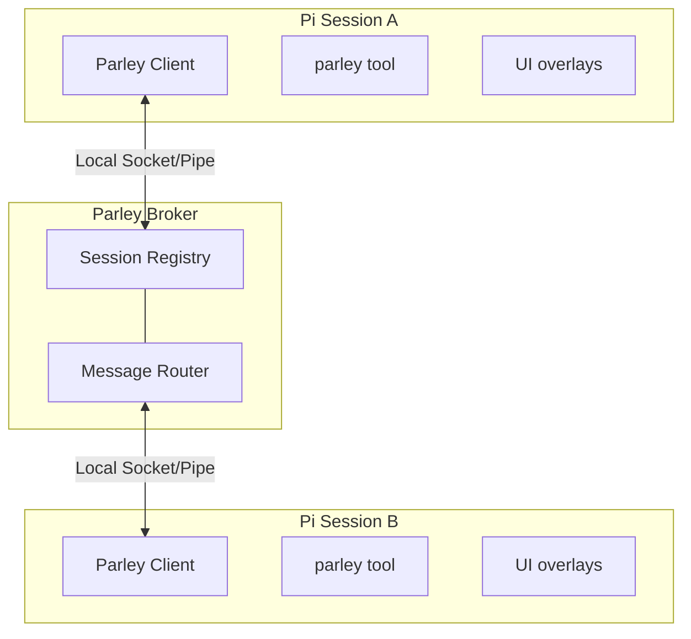

# Pi Parley

Parley is a durable conversation layer for Pi sessions: targeted messaging, explicit asks and replies, honest delivery receipts, and opt-in broker federation for remote peers — whether you're driving the conversation or letting agents coordinate. Local sessions connect automatically.

**Alt+M** or **`/parley`** opens the session picker and message composer. Agents communicate through the `parley` tool.

## Why

Sometimes you're running multiple pi sessions — one researching, one executing, one reviewing. Pi Parley lets you:

- **User-driven orchestration** — Send context or findings from your research session to your execution session
- **Agent collaboration** — An agent can reach out to another session when it needs help or wants to share results
- **Session awareness** — See what other pi sessions are running, their concise current focus, and live status

Unlike pi-messenger (a shared chat room for multi-agent swarms), parley is optimized for chosen recipients. Group sends have independent outcomes; host-local broadcast reaches every live peer visible to the caller.

Parley also integrates with [pi-subagents](https://github.com/nicobailon/pi-subagents), providing scoped child visibility and a fallback supervisor channel when no native channel is available.

## In One Minute

Each pi session that has parley loaded and enabled connects to a tiny local broker over a local IPC transport. The broker keeps track of connected sessions and routes an independent direct message to each session you target by name or session ID. The extension gives you both a tool (`parley`) and a small overlay UI (`/parley` or `Alt+M`). Incoming messages are rendered inline inside the recipient session, can trigger a turn immediately by default, and are also stored in Pi session history as extension entries. If you want a stricter local trust posture, `inboundTrigger` can reduce or disable auto-triggering.

## Install

Install the package:

```bash
pi install npm:pi-parley
```

Restart Pi. Enabled sessions connect automatically, and the package supplies the `pi-parley` skill with conversation and delivery context.

For local development, register the checkout path instead of an npm copy:

```bash
pi install /absolute/path/to/pi-parley
```

This loads the working tree. Reload a session after editing extension code; broker changes also need a [broker restart](#updating-parley).

### Pi compatibility

This package supports both Pi distributions:

- `@mariozechner/pi-coding-agent` 0.73.1
- `@earendil-works/pi-coding-agent` 0.80.3 or newer with a compatible sibling-package set; 0.80.3 is tested with `pi-agent-core`, `pi-ai`, and `pi-tui` pinned to 0.80.3, while the current 0.85.1 release is tested with its default resolution

Installing pi-parley does not install or replace either coding-agent distribution or duplicate its host libraries. Pi, TUI, and TypeBox are optional peers supplied by the host; Runtime dependencies are `tsx`, used by the standalone broker, and `fs-native-extensions`, which supplies OS-managed file locks. The native addon ships prebuilt binaries for macOS, Linux and Windows on x64/arm64; Linux requires kernel 3.15 or newer. The fork loader maps the upstream-compatible extension imports to its own host modules. Fork hosts publish name changes to extensions immediately; upstream 0.73.1 exposes the same core event only to RPC/TUI consumers, so pi-parley uses a one-second compatibility fallback there. `npm run test:host-compat` packs the extension and boots it under upstream 0.73.1, a coherent fork 0.80.3 dependency set, and fork 0.85.1 without allowing one coding-agent distribution to pull in the other.

The child-session integration is optional at runtime. An ordinary Pi session without pi-subagents bridge metadata gets normal parley behavior. Child-only visibility and the fallback `contact_supervisor` tool activate only when pi-subagents provides the corresponding environment metadata; if its native supervisor channel is available, pi-parley leaves that tool to the native channel.

A session becomes parley-connected when all of these are true:
- the `pi-parley` extension is installed and loaded in that session
- `enabled` is not set to `false` in the parley config file, which defaults to `~/.pi/agent/parley/config.json`
- the session has started or reloaded after the extension was installed
- the local broker is running or can be auto-started

The session list shows connected sessions visible through the caller's routing scope and subagent permissions, not every open Pi process. Remote rows identify their origin and negotiated support: text conversations, text sends only, or discovery only. Remote attachments, mailboxes, and broadcast are not supported.

If a session is unnamed, pi-parley exposes a collision-resistant runtime-only fallback alias like `session-1a2b3c4d-5e6f-7a8b` so other connected sessions can target it. That alias is not persisted as the Pi session title or treated as a reconnect identity, so `pi --resume` can keep showing the transcript snippet without allowing a different unnamed process to inherit queued mail.

### Identity and focus

`/alias` edits the current session's persisted Pi name; with no argument it opens an input in interactive mode. The `rename` tool action accepts `name` for the same canonical identity change. Neither renames another session. Send/ask call displays and delivery results include the sender identity used for that contact.

Any parley action accepts an optional `profile` with `name` and/or `description`. Descriptions are 5–9 word focus labels; `description: null` clears one. A profile name can fill an unnamed/generated identity or revise a profile-managed name, but cannot replace an explicit user or host name. Results distinguish the canonical Pi name, broker-confirmed parley identity, focus, and publication status. Focus is display metadata, not a routing or permission boundary.

## Conversations

`send` shares information; `ask` requests an answer; `reply` communicates back to the colleague. Questions can wait for an answer in the tool call or receive it later while work continues. A notification stays a notification even when another question is pending, and colleagues can consult each other without closing the original question.

Messages carry the sender, the text, and related conversation context. Receipts include exact message IDs and observed delivery state. Endpoint acceptance, a colleague's answer, and completed work are different events. Unknown delivery may mean the message arrived but its acknowledgement did not.

Incoming content can wake an idle session or join a busy session's next model turn, including headless sessions. Attachment names label inline text snapshots, not files created in the receiving workspace.

### Retained context

Action results include a small view of pending conversations. `pending`, `status`, and `read` expose unanswered requests, outgoing questions, and retained message text. Session history supports reload/resume recovery, including interrupted delivery; it is not a promise of exactly-once processing.

The local wait normally ends after ten minutes (`PI_PARLEY_ASK_TIMEOUT_MS`), but that does not withdraw the question. Cancellation removes undelivered mail or communicates withdrawal; work already performed remains unchanged.

Local history and broker routing have different lifetimes. Thread relationships survive endpoint reconnects but remain bounded broker memory (up to one hour and 4,096 recent relationships). Offline mail lasts up to 24 hours while the broker remains running. Neither survives a broker restart. A locally retained message may therefore remain readable after its thread is no longer authorized.

## Tool Reference

### parley

| Parameter | Type | Description |
|-----------|------|-------------|
| `action` | string | `"list"`, `"list-cwd"`, `"send"`, `"broadcast"`, `"ask"`, `"reply"`, `"pending"`, `"read"`, `"status"`, `"cancel"`, `"advertise"`, or `"rename"` |
| `to` | string | One target session name or ID. Without `cwd`, send/ask resolve it within the visible roster. With `cwd`, send/ask require the target to be in that directory. Also disambiguates reply. |
| `targets` | string[] | For `send`, 1–32 explicit session names or IDs. Each recipient gets an independent message and delivery outcome. Cannot be combined with `to`, cwd targeting, or conversation-specific reply/retry/supersede fields. |
| `message` | string | Message text (for send/broadcast/ask/reply) |
| `attachments` | array | Inline text snapshots: `{ type: "file" \| "snippet" \| "context", name, content, language? }`. No files are created at the destination. |
| `replyTo` | string | Exact message ID for conversation threading. `reply` explicitly answers; a threaded `send` remains a notification. |
| `messageId` | string | Exact message ID for `cancel` or retained-message `read`; session-ID prefix matching does not apply |
| `supersedes` | string | Optional previous message ID that this send/ask explicitly replaces |
| `retryOf` | string | Optional previous message ID that this send/ask explicitly retries |
| `cwd` | string | Working directory filter for `list-cwd`. For send/ask, scopes target lookup to that directory; without `to`, selects the sole live peer there. |
| `blocking` | boolean | For `ask`, `true` waits for the answer (default); `false` returns the initial delivery outcome and receives the answer later in the conversation |
| `openProjectPaneIfMissing` | boolean | For `send`/`ask` with `cwd`, launch Pi in that project through a registered generic project launcher when no matching live session exists |
| `focus` | boolean | For `openProjectPaneIfMissing`, focus the new terminal when the launcher supports it. Defaults to true |
| `name` | string | Canonical self-name for `rename`, or public subagent name for `advertise` |
| `profile` | object | Optional self-profile update: `{ name?, description? }`; `description: null` clears focus |

### contact_supervisor

Registered only with the required pi-subagents child bridge metadata and no native supervisor channel. Contacts the supervisor session that delegated the current task.

| Parameter | Type | Description |
|-----------|------|-------------|
| `reason` | string | `"need_decision"` (blocking), `"interview_request"` (blocking structured questions), or `"progress_update"` (fire-and-forget) |
| `message` | string | The decision request, optional interview note, or progress update |
| `interview` | object | Required for `interview_request`: `{ title?, description?, questions: [...] }` |

**`need_decision`** — Sends a formatted ask to the supervisor and blocks until it replies (10-minute timeout by default; configurable with `PI_PARLEY_ASK_TIMEOUT_MS`). The reply comes back as the tool result. Includes run metadata in the message so the supervisor knows which subagent is asking.

**`interview_request`** — Sends a formatted, agent-readable interview to the supervisor and blocks until it replies. Questions use a local pi-interview-like shape: `{ id, type, question, options?, context? }` where `type` is `single`, `multi`, `text`, `image`, or `info`. `info` questions are context-only and do not need responses. The supervisor reply should be JSON with `{ "responses": [{ "id": "...", "value": ... }] }`. Validated responses are returned in `details.structuredReply`; parse or validation failures are also reported in the visible result text.

**`progress_update`** — Sends a non-blocking update to the supervisor and returns the delivery outcome, not a supervisor answer. Intended for meaningful discoveries that change the plan.

### parley actions

**`list` / `list-cwd`** — Returns the current session and visible connected peers with name, short session ID, directory, focus, model, context usage, and activity. `list-cwd` filters by directory. Activity follows Pi lifecycle events: `idle`, `thinking`, `tool:<name>`, or, on supported hosts, `compacting`. Presence changes do not wake peers. Federation rows indicate their remote capabilities.

**`send`** — Sends to one `to` or independently to 1–32 explicit `targets`. Duplicate aliases for one live endpoint deliver once; partial failures do not roll back successes. Group sends reject `replyTo`, `supersedes`, and `retryOf`. A singular send can carry thread context, but never infers or completes an ask's answer. `confirmSend` can require one UI approval before ordinary delivery; group approval pins the resolved endpoints so an alias cannot silently rebind afterward.

**`broadcast`** — Sends independent messages to the current snapshot of visible live **host-local** peers, excluding the sender. Scope and subagent permissions still apply. It neither includes remote rows nor queues disconnected sessions, and rejects targeting/thread fields.

**`ask`** — Sends a question to a connected local recipient or a negotiated remote conversation endpoint. It waits for the explicit answer by default, or returns the initial delivery outcome with `blocking: false`. Asynchronous answers enter the conversation later, including while a headless caller works. Offline asks fail rather than entering a mailbox. Timeout and cancellation are separate outcomes.

**`reply`** — Explicitly answers a pending ask or threads a response to an ordinary message. It uses the active parley context, otherwise the sole pending ask; `to` can select a sender and exact `replyTo` can select a retained message. Ambiguity returns candidate context rather than guessing. A clarification `ask` does not complete the original question.

**`pending` / `read`** — `pending` shows unanswered-request context, including exact IDs and reply-window state. `read` returns one retained incoming message's full text and attachment snapshots by `messageId`; it is not an archive search or remote-file read.

**`cancel`** — Operates on an exact message ID previously sent by this session. It distinguishes offline removal, known nondelivery, and withdrawal requested from a live recipient. Unknown outcomes remain unknown. A visible withdrawal or supersession notice does not erase earlier messages or undo work.

**`status`** — Reports connectivity, the current session ID, visible connected-session count, and locally tracked outstanding questions, including requests whose local wait has ended. Local age is not an authoritative broker completion signal.

**`rename` / `advertise`** — `rename` sets this session's canonical Pi name through `name`. `advertise` is the subagent-only public-discovery action; changing a canonical name alone does not widen visibility permissions.

### Directory targeting and project launch

For `send`/`ask`, `to` alone resolves within the visible roster. `cwd` addresses a local directory: alone it selects the sole local peer there; with `to` it constrains lookup to that directory. `openProjectPaneIfMissing: true` enables a launch attempt when no matching peer exists.

Parley uses a generic launcher, not a built-in terminal manager. It selects a visible local session advertising `pi-parley/project-launch-v1`; otherwise it uses the configured `PI_PARLEY_PROJECT_LAUNCHER` (or config `projectLauncher`). With neither, no launch is attempted.

The provider API receives an ordinary parley message containing `{ type: "pi-parley/project-launch-request", root, command, focus }`. A configured command receives the raw root in `PI_PARLEY_PROJECT_ROOT`; a bare `{root}` placeholder is replaced with a shell-quoted path. There is no default command.

Results preserve separate observations: **launch request accepted or command started**, **new peer registration observed**, and **message accepted**. A later failure does not erase earlier stages. The v1 request carries no requested name or registration correlation: it observes a sole new local peer in the project, cannot prove that a particular launch created it, and reports ambiguity when several appear. Ending the registration wait does not cancel startup; repeating a launch can create another visible surface.

### Just-in-time compaction awareness

Successful compactions advance a private broker-owned generation for the session's stable parley ID. At the next accepted direct contact, `send`, `ask`, `reply`, the compose overlay, and each explicit multicast outcome say when that peer compacted since the previous direct contact. Incoming direct messages carry the same notice in the message already being delivered. When a peer is live and current context usage is known, the notice includes it so references can be made explicit before relying on older conversational detail; queued contact never describes a disconnected presence snapshot as current.

The first contact between two identities establishes a synchronously durable baseline without making a historical claim. Directional contact watermarks and compaction generations persist across reconnects and broker restarts; detection compares generations rather than elapsed time, so machine sleep and clock changes do not create false positives. Broker state files, limits, and recovery are isolated per scope; those files hash scopes, stable session IDs, and compaction event IDs rather than storing routing identities in plaintext. The Pi session journal retains opaque pending event IDs so compaction reports can be retried until the broker acknowledges durable storage.

Compaction itself never sends a message or wakes another session. Broadcast neither displays nor consumes compaction notices and never enters the collaboration graph. A send rejected before acceptance does not advance contact watermarks. Sender first-contact baselines are durable before delivery success; receiver baselines are durably staged before delivery and promoted only after the surfaced message's opaque token is acknowledged. The Pi session journal retries an unconfirmed receiver token across reconnects and broker restarts. Later compaction notices also remain pending until acknowledgement and may safely repeat rather than be lost. Clients that do not advertise the capability cannot silently consume a notice.

## Keyboard Shortcuts

| Key | Action |
|-----|--------|
| Alt+M | Open session list overlay |
| ↑/↓ | Navigate session list |
| Enter | Select session / Send message |
| Escape | Cancel / Close overlay |

## Config

Create `~/.pi/agent/parley/config.json`:

```json
{
  "brokerCommand": "npx",
  "brokerArgs": ["--no-install", "tsx"],
  "confirmSend": false,
  "inboundTrigger": "always",
  "enabled": true,
  "replyHint": true,
  "status": "researching"
}
```

| Setting | Default | Description |
|---------|---------|-------------|
| `brokerCommand` | `"npx"` | Advanced trusted override for the broker executable. The default value is hardened internally to launch the resolved bundled `tsx` CLI through the current Node executable instead of resolving `npx` through `PATH`. |
| `brokerArgs` | `["--no-install", "tsx"]` | Advanced trusted arguments passed to custom `brokerCommand` before the broker script path |
| `confirmSend` | false | Show a confirmation dialog before ordinary sends from an interactive session with UI; caller-supplied `replyTo` skips it |
| `inboundTrigger` | `"always"` | Auto-trigger policy for unsolicited broker messages: `"always"`, `"replies"`, or `"never"`. Requested asynchronous answers, withdrawal notices, and local in-process subagent relay events have explicit delivery paths. |
| `enabled` | true | Enable/disable parley entirely |
| `replyHint` | true | Include a reply affordance for incoming asks in the rendered message |
| `status` | — | Optional custom status suffix shown after the automatic lifecycle status, for example `thinking · researching` |

If `config.json` cannot be parsed or contains an invalid value, pi-parley logs the error and uses safe defaults: `inboundTrigger: "never"` and `confirmSend: true` until the config is fixed. Explicit requested-answer and control-notice delivery still applies. A valid explicit `enabled: false` remains respected even if another setting is invalid; outbox sends without a confirmation UI stay blocked.
Obsolete `toolVisibility` values are ignored; the generic `parley` tool remains stable in the active tool set for prompt-cache friendliness.

Custom broker commands are trusted local configuration: anyone who can edit this config can choose the executable used for future broker auto-spawns. For example, if you have Bun installed and want it to start the broker directly, use:

```json
{
  "brokerCommand": "bun",
  "brokerArgs": []
}
```

Pi Parley publishes live session status automatically. Sessions register as `idle`, switch to `thinking` while the agent is running, and show `tool:<name>` during tool execution. On hosts that report unsuccessful compactions to extensions (Earendil Pi 0.85+), they also publish `compacting` from pre-compaction until success, failure, or abort; the underlying thinking/tool/idle state resumes afterward. Older hosts leave compaction presence disabled rather than risk stale status after an unreported failure. This is passive roster presence and never wakes peer agents. If `status` is set in config, it is appended as context instead of replacing the lifecycle status.

Set `PI_PARLEY_SCOPE_ID` before starting Pi to opt a session into an opaque broker routing scope. The value is trimmed. Empty values are treated as unscoped. A scoped session can list, address by full ID, name, ID prefix, or cwd, receive presence and session lifecycle events, recover queued mailbox messages, and use extension-channel owner, publish, and state traffic only with sessions that registered the exact same scope. Scoped sessions and unscoped sessions do not cross this boundary. Existing unscoped behavior is unchanged when the variable is not set.

By default, runtime state and config live under `~/.pi/agent/parley`. If Pi is launched with `PI_CODING_AGENT_DIR`, pi-parley uses `$PI_CODING_AGENT_DIR/parley` instead, including `config.json`, broker PID/lock files, sockets, and launcher state.

## Extension channels

Other Pi extensions can use parley's broker for bounded, non-conversational coordination. Extension-channel traffic never calls `pi.sendMessage()`, never enters a session transcript, and never starts an agent turn.

Register during `session_start` so parley includes the capability in its deferred broker registration:

```typescript
// Use @earendil-works/pi-coding-agent here when targeting that distribution.
import type { ExtensionAPI } from "@mariozechner/pi-coding-agent";
import {
  PARLEY_EXTENSION_REGISTER_EVENT,
  type ParleyExtensionChannel,
} from "pi-parley/extension-api.ts";

export default function (pi: ExtensionAPI) {
  let channel: ParleyExtensionChannel | undefined;

  pi.on("session_start", () => {
    pi.events.emit(PARLEY_EXTENSION_REGISTER_EVENT, {
      namespace: "example/v1",
      ownerEligible: true,
      onReady: (value: ParleyExtensionChannel) => { channel = value; },
      onEvent: (event: unknown) => { /* owner, state, peer, or payload event */ },
    });
  });
}
```

The broker:

- advertises `extension-bus-v1` through feature negotiation
- routes payloads only to sessions advertising the same namespace
- elects one owner per namespace and changes its epoch after socket replacement
- rejects stale owner-only writes
- stores at most 64 KiB of opaque, revisioned state per namespace

`channel.publish()` accepts payloads up to 16 KiB. A `capable` broadcast includes the sender, so consumers must not blindly republish messages they receive. `channel.commitState()` uses compare-and-swap against the last observed revision. Capabilities registered after the broker connection is established are synchronized without reconnecting. If the broker does not advertise extension-channel support, clients do not send extension operations.

### Extension outbox

Same-process extensions can request a user-visible parley send through the consent-aware outbox. Emit `parley:outbox-request` with a unique `requestId`; listen for `parley:outbox-result` and treat `sent`, `rejected`, `blocked`, and `failed` as terminal states. There is no fire-and-forget mode.

```typescript
import {
  PARLEY_OUTBOX_REQUEST_EVENT,
  PARLEY_OUTBOX_RESULT_EVENT,
  type ParleyOutboxResult,
} from "pi-parley/extension-api.ts";

pi.events.on(PARLEY_OUTBOX_RESULT_EVENT, (result: ParleyOutboxResult) => {
  if (result.requestId === "example-request-1") {
    // Handle the terminal result.
  }
});

pi.events.emit(PARLEY_OUTBOX_REQUEST_EVENT, {
  version: 1,
  requestId: "example-request-1",
  extensionId: "example-extension",
  extensionName: "Example Extension",
  to: "planner",
  message: "Build finished.",
});
```

`confirmSend` applies to outbox requests. If confirmation is required and no UI is available, the request fails closed with `confirmation_unavailable`. The outbox resolves the target through the current session's scoped parley client, so extensions cannot choose the sender, scope, or resolved target ID. Duplicate `requestId` values are rejected and do not deliver again. Receiver messages include structured `extension_outbox` provenance in message details and model-visible sender context.

### Embedded actor extension

Applications that must enroll every Pi actor can bundle the complete package and call the explicit Pi-only TypeScript entrypoint from their required extension wrapper:

```typescript
import type { ExtensionAPI } from "@earendil-works/pi-coding-agent";
import { registerParleyExtension } from "pi-parley/extension";

export default function applicationExtension(pi: ExtensionAPI) {
  registerApplicationStatus(pi);
  registerParleyExtension(pi, {
    resolvePresenceName(candidate, context) {
      return context.kind === "advertised"
        ? `application:child:${candidate ?? "child"}`
        : `application:${candidate ?? "session"}`;
    },
  });
}
```

The optional synchronous `resolvePresenceName(candidate, context)` policy controls every broker-visible name while leaving Parley unaware of the application's naming scheme. `candidate` is the canonical Pi session name or `undefined`; `context.kind` is `"session"` for initial connection, reconnect, compatibility-polled host renames, `/alias`, self rename, and ordinary presence updates, or `"advertised"` for the explicit `advertise` name. The trimmed nonempty result becomes the broker/client name. Throws, non-string results, and empty results fail the triggering startup or operation and never fall back to publishing the raw candidate. Keep the resolver deterministic and side-effect-free.

Call `registerParleyExtension()` once as the wrapper factory's final potentially throwing operation, not from `session_start`, and load the required wrapper before optional user packages. Register the application's own resources first and do not throw after Parley returns: older supported Pi hosts do not retract event subscriptions when an outer extension factory later fails. Registration is idempotent across physical copies that implement this v1 actor entrypoint in one Pi runtime; an ambient-first v1 owner accepts a later wrapper's resolver before its first identity publication, while conflicting or late configuration fails closed. Shutdown releases that runtime claim so reload and session replacement bind fresh handlers. An older ambient pi-parley release cannot participate in the claim protocol and must be updated or excluded before an application forces its bundled actor. The factory starts no process, socket, watcher, or timer. Session-scoped work starts from lifecycle events or the first operation and is joined by Parley's `session_shutdown` handler; the wrapper owns no Parley teardown.

Install the bundled tarball as the wrapper's private ordinary dependency rather than as another Pi package. The complete tarball and its production dependencies are required because the actor uses Parley's TypeScript extension, UI, client, broker, and spawn modules. Pi supplies the peer extension-runtime, TUI, and TypeBox modules. The application must set generic routing such as `PI_PARLEY_SCOPE_ID` before Pi loads extensions. A temporary FlightDeck launch-context bridge remains during rollout of that generic variable and version-matched remote actor enrollment; it is compatibility behavior, not part of the public embedding contract.

### Broker federation facade

Cross-computer transport is caller-loaded and opt-in. Parley does not discover hosts, approve topology, import a transport provider, or reconnect links. The compiled `pi-parley/federation` entrypoint works in plain Node ESM without a TypeScript loader and keeps broker paths, endpoint credentials, control frames, origins, and handshake machinery behind one public boundary.

```typescript
import {
  inspectBroker,
  attachBrokers,
  type BrokerHostAccess,
  type ScopeBinding,
} from "pi-parley/federation";

const laptop = await inspectBroker(laptopAccess, { signal });
const server = await inspectBroker(serverAccess, { signal });

const laptopScopes: ScopeBinding[] = [{
  localScopeId: "team",
  localScopeAlias: "laptop",
  remoteScopeAlias: "server",
}];
const serverScopes: ScopeBinding[] = [{
  localScopeId: "team",
  localScopeAlias: "server",
  remoteScopeAlias: "laptop",
}];

const link = await attachBrokers({
  initiator: { broker: laptop, originLabel: "Laptop", scopeBindings: laptopScopes },
  acceptor: { broker: server, originLabel: "Server", scopeBindings: serverScopes },
  signal,
  timeoutMs: 10_000,
});

await link.close();
```

A `BrokerHostAccess` is rooted at one Pi agent directory. It offers bounded reads relative to that root and opens only exact host-local Unix sockets, named pipes, or loopback TCP endpoints requested by Parley. `createLocalBrokerAccess()` provides this capability for the current machine; remote-management applications can adapt their existing authenticated host streams. TCP state credentials never leave the facade in endpoints, handles, JSON, or errors.

`inspectBroker()` returns a frozen, runtime-opaque handle containing the canonical Parley installation origin and an immutable live-scope snapshot. It owns no persistent stream. Inspection may mint the installation's first federation origin, so caller consent belongs before inspection. A TCP handle becomes stale after broker restart.

`attachBrokers()` validates both handles and independently supplied scope mappings before opening either endpoint. It opens both streams concurrently under one deadline, aborts a sibling acquisition after failure, joins late streams, and transfers ownership to the brokers only after both opens succeed. It never rediscovers, retries, reconnects, or replays. Readiness means both brokers accepted the handshake. The returned attachment has a non-rejecting `completion` and idempotent `close()`; both join admitted writes and owned stream cleanup. Sanitized `BrokerInspectionError` and `BrokerAttachmentError` codes contain no provider diagnostics, paths, credentials, or raw frames.

## How It Works



The broker is a standalone TypeScript process that manages session registration and message routing. It auto-spawns when the first parley-enabled session needs it and exits after 5 seconds when the last connected session and peer link disconnect. Clients now reconnect automatically if the broker disappears and later comes back.

**Liveness heartbeat.** Transport loss can leave a connection apparently open without a responsive broker. Each registered client round-trips a lightweight `list` request and tears down the socket if the broker does not respond within the timeout, allowing reconnection. The interval defaults to 30s and the probe timeout to 5s; override them with `PI_PARLEY_LIVENESS_INTERVAL_MS` and `PI_PARLEY_LIVENESS_TIMEOUT_MS` (the timeout is clamped to the interval).

Messages use length-prefixed JSON over a local socket/pipe transport (4-byte length + JSON payload) to handle fragmentation properly. The protocol includes request correlation for session listing, explicit delivery failures, validation for malformed or out-of-order messages, a frame-size cap, per-connection local rate limiting, and no-op presence coalescing.

**Experimental broker federation.** A caller-owned authenticated stream attaches two brokers without making either broker network-addressable. The neutral attachment controller handles the single-use `bridge_attach` preface and independently authorized `broker_accept_peer` preparation; that exact prepared destination connection becomes the opaque pipe. Readiness requires the brokers' strict `peer_hello` / `peer_hello_ack` handshake. Public scope aliases never expose private local scope IDs, and peer links never impersonate ordinary local clients.

When both brokers negotiate `peer-roster-v1`, each link exchanges an authoritative bounded snapshot followed by monotonically sequenced deltas under a broker-lifetime origin epoch. Sequence gaps request a fresh snapshot; stale epochs cannot roll state back; and disconnect atomically prunes only that link's imported sessions. Brokers export only locally owned mains and explicitly advertised subagents, never re-export imports. Raw local scope IDs remain link-local authority while public aliases qualify remote identities. Imported rows are visibly marked `remote:…`, are never `trustedLocal`, and respect local scope/subagent visibility.

`peer-send-v1` supports direct text sends (≤32 KiB) to imported `oqs1.*` sessions. The destination authenticates the sender through its imported roster and enforces local target ownership, scope, and visibility. A correlated destination result confirms acceptance; a missing acknowledgement does not prove nondelivery. Legacy links remain send-only or discovery-only.

`peer-conversation-text-v1` adds text asks, replies, and threaded progress when both brokers **and participating endpoint clients** support the conversation contract and exact sends. Before an ask installs its waiter/history, `prepareConversation()` returns a canonical `oqm1.*` message ID and pinned author/recipient snapshots. Retained IDs include the original author's origin, scope, broker incarnation, session identity, endpoint incarnation, and nonce. Replies retain the original `replyTo`; only the recorded counterpart with both endpoint and broker incarnations intact may answer. Progress does not complete an ask, and replacement endpoints are not rebound. Ordinary notifications on capable endpoints also retain replyable conversation identities.

A bounded, flushed dispatch journal records attempts before dispatch. Uncertain outcomes survive broker-process crashes/restarts and reconnects without automatic replay; only a positively correlated preacceptance nondelivery verdict can rearm an attempt. Retained uncertainty still blocks an unchanged legacy retry if its name now resolves locally or the target upgrades to conversations; preflight checks the original identity before conversion. Capability downgrade does not turn a retained receipt into known nondelivery. Caller-supplied scalar identities are durably associated with converted handles before preparation returns; association alone is not dispatch, and both identities share one admission record. Retained identities remain unknown/non-retryable when discovery or preflight cannot recover a verdict, while fresh operations remain known-unsent before dispatch. Passive lookup creates no journal; an incomplete final append preserves the verified prefix and allows unrelated local work while disabling new federated dispatch. Unreadable or corrupt complete history is not treated as absence. Persistence failure or exhausted retention fails closed before a new dispatch. This is a broker-process recovery guarantee, not a promise of recovery after host power loss or filesystem loss. If an answer arrives before a lost ask acknowledgement, the blocking tool returns the answer while keeping transport acceptance explicitly unknown.

The broker owns a persisted canonical federation origin (adopted from the first controller-supplied id or minted as `install:<uuid>`), exposed with live scope enumeration through the trusted-local `broker_list_scopes` control; every dial/accept must present exactly it.

Caller-owned endpoint snapshots additionally require `peer-send-exact-v1`: replacement endpoints fail with `E_TARGET_REBOUND`, and legacy links reject pinned sends rather than silently delivering to a replacement. Ordinary re-resolvable sends remain compatible with `peer-send-v1`. Remote attachments, supersession, queued mailboxes, broadcast, extension channels, compaction awareness, and multi-hop routing are outside this slice. Identity transport, roster replication, direct sends, and conversations negotiate independently; rolling older local clients keep their original metadata schema.

Session IDs are the trusted addressing key within one broker routing scope. Duplicate names remain allowed, but ambiguous names fail rather than selecting a recipient. The stable session ID shown by `list`/`status` distinguishes those endpoints. Mail queued for a disconnected session is redelivered to a session that reconnects under the same session ID, or to a session that matches both its explicit name and its directory, so a same-named session in a different project never inherits another project's queued messages. Runtime-only `session-...` aliases are excluded from name-based mailbox reconnection, and a disconnected mailbox is never remapped to the sender. Set `PI_PARLEY_STABLE_ID` or `stableId` in `config.json` to pin a session's parley ID across full process relaunches; `config.json` is machine-global, so a fixed `stableId` there applies to every session on the machine and the newest registration takes over that identity only within the same `PI_PARLEY_SCOPE_ID` boundary. The broker owns local trust metadata such as `trustedLocal`; `peerUid` is reserved for runtimes that can expose real peer credentials and is left unset otherwise. Client-supplied cwd/model/pid/status are display metadata, not authentication.

Async extension work (startup, inbound flushes, reconnects, overlays, and relays) no-ops if the session shuts down or reloads before it settles.

Runtime files live at `~/.pi/agent/parley/` by default, or `$PI_CODING_AGENT_DIR/parley/` when `PI_CODING_AGENT_DIR` is set:
- `broker.sock` — Unix domain socket for communication (macOS/Linux only; Windows uses a named pipe instead)
- `broker-launch.vbs` — Windows helper script used to launch the broker without a console window
- `broker.pid` — Broker process ID
- `broker.startup/.process.lock` — Permanent advisory startup lock
- `broker.ownership/.process.lock` — Permanent broker lifetime lock
- `broker.port.json` — Authenticated dynamic localhost endpoint when TCP transport is explicitly enabled
- `config.json` — User configuration

Supported `config.json` keys include `stableId` for restart-stable addressing, `status` for a custom status suffix, `inboundTrigger` (`always`, `replies`, or `never`), `replyHint`, `confirmSend`, and advanced broker launch overrides.

## Design Decisions

**Local broker IPC instead of a listening network service.** `pi-parley` uses Unix sockets on macOS/Linux and a named pipe on Windows, which keeps local setup simple and avoids exposed broker ports. Cross-machine federation delegates authenticated transport and ephemeral loopback attachment to a host controller rather than making the broker network-addressable. Authenticated loopback TCP is an explicit alternative on any platform with `PI_PARLEY_TRANSPORT=tcp` (or `PI_PARLEY_TCP=1`), useful when local IPC is unavailable. In that mode the broker binds a dynamic `127.0.0.1` port, records the endpoint plus a local secret under the parley state dir, and requires that secret before health or registration succeeds. Health replies do not echo the secret, so a random localhost process cannot discover it through the broker protocol.

**Runtime ownership.** One broker owns each runtime directory until shutdown completes. Ownership is an OS-managed file lock, not a PID or an elapsed-time lease: paused owners remain owners, and process exit releases the lock. A separate short-lived startup lock coordinates clients starting that broker. Lock files stay at stable paths and are never deleted to reclaim ownership. The lock files contain no metadata; separate `.process.owner.json` diagnostics may be stale or incomplete and never establish ownership. Runtime directories must remain on a local filesystem and must not be moved or replaced while in use.

**Conversation intent is explicit.** The broker correlates ask/reply edges while the client owns blocking waits and asynchronous conversation delivery. Threading alone is not an answer: notifications preserve pending questions, and explicit replies settle them. Request IDs also correlate roster queries so a delayed list cannot be mistaken for a newer one.

**Broker lifecycle.** The broker starts when needed and exits after five seconds with no registered sessions or federation links. Extension reload reuses a healthy broker; it does not replace the broker process. For broker-code updates, stop the broker gracefully and verify its exit before starting it again. Health reports the running PID, unique instance ID, package version and a source snapshot captured at startup. The source snapshot fingerprints packaged root/broker sources and metadata on disk, not dependency binaries or proof of module contents during concurrent checkout edits.

## pi-parley vs pi-messenger

| Aspect | pi-parley | pi-messenger |
|--------|-------------|--------------|
| **Model** | Targeted messaging, with explicit groups and opt-in broadcast | Shared chat room |
| **Primary use** | User orchestrating sessions | Autonomous agent coordination |
| **Discovery** | Broker-based (real-time) | File-based registry |
| **Messages** | Private by default; recipients are chosen for each send | Broadcast to all agents |
| **Persistence** | In Pi session history | Shared coordination files |

Pi-messenger centers a shared room; pi-parley centers conversations with chosen recipients. Its broadcast is host-local and still visibility-filtered.

## File Structure

```
<pi-parley package or checkout>/
├── package.json
├── index.ts              # Extension entry point
├── types.ts              # SessionInfo, Message, protocol types
├── config.ts             # Config loading
├── project-agent.ts      # Generic project-launch providers/commands and cwd target resolution
├── reply-tracker.ts      # Retained incoming context and explicit reply selection
├── conversation-history.ts # Journaled conversation recovery
├── message-results.ts    # Model-visible delivery and withdrawal outcomes
├── broker/
│   ├── broker.ts         # Broker process and connection roles
│   ├── client.ts         # ParleyClient class
│   ├── build.ts          # Startup package/source identity
│   ├── process-lock.ts   # Kernel-owned lifetime leases
│   ├── runtime-claim.ts  # Broker ownership before initialization
│   ├── federation-types.ts    # Broker-peer wire contracts
│   ├── federation-protocol.ts # Strict validators and qualified ID codec
│   ├── federation-roster.ts   # Snapshot/delta import and resynchronization
│   ├── federation-send.ts     # Routed direct send frames and correlation
│   ├── federation-conversation.ts # Qualified identities and durable dispatch barriers
│   ├── attachment.ts          # Neutral owned streams and lazy provider registration
│   ├── federation-origin.ts   # Persisted canonical federation origin
│   ├── peer-link.ts      # Peer authority, handshake, and lifecycle
│   ├── framing.ts        # Length-prefixed JSON protocol
│   ├── paths.ts          # Platform-specific socket/pipe paths
│   ├── spawn.ts          # Auto-spawn and advisory startup ownership
│   ├── spawn.test.ts     # Broker spawn tests
│   └── paths.test.ts     # Path resolution tests
├── ui/
│   ├── session-list.ts   # Session selection overlay
│   ├── compose.ts        # Message composition overlay
│   └── inline-message.ts # Received message display
└── skills/
    └── pi-parley/
        └── SKILL.md      # Conversation and delivery context
```

## Limitations

- **Remote conversations are negotiated text-only** — Capable brokers and endpoint clients support asks/replies/progress; older links remain send-only or discovery-only. Attachments, remote mailboxes, and multi-hop routing are unsupported.
- **Bounded inspection, not a separate archive** — `pending` and `read` expose retained incoming context; journaled history lives in the Pi session, not a standalone durable inbox
- **No attachments UI** — `file`, `snippet`, and `context` attachments are supported in the protocol, but not in the compose overlay
- **Visibility is scoped** — The roster includes connected sessions permitted by routing scope and child ACLs, not every Pi process or every sibling
- **Broker-memory mailboxes** — The broker auto-spawns and clients reconnect after a restart, but queued offline messages do not survive broker exit

## Updating Parley

The extension and the broker are separate processes. Reloading a session updates its extension, but reuses a healthy broker; the health handshake checks wire compatibility, not the installed package version. Rolling reloads and federation links can keep that broker running indefinitely.

For an update that changes broker code:

1. Install or pull the desired release for every client sharing the runtime directory, then reload those clients. Do this at a quiet boundary: reconnecting interrupts blocking waits.
2. On macOS/Linux, read `broker.pid`, verify it is the expected Parley process and send it `SIGTERM`; an unchecked PID can be stale or reused. Windows process signals force termination, so use the normal idle shutdown after disconnecting all clients and federation links when a graceful flush is needed. Verify broker exit before restart. Collaboration state is flushed on graceful shutdown; queued offline mail and broker-memory thread routes do **not** survive broker exit.
3. Reconnect clients to start the broker from the updated installation. Check its new health instance ID/PID and startup package/source snapshot, then verify the roster and real messaging. The snapshot describes startup files, not dependency binaries or concurrently edited module contents. Federation controllers must reconnect their links.

There is no automatic version-based broker replacement. A client must not restart or downgrade a shared broker merely because its own installation differs.
